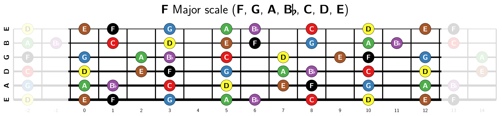

# Guitar fretboard

The `guitar-fretboard` package can be used to generate some nice-looking
guitar fretboard diagrams. Those diagrams can highlight scales, arpeggios or
more generic intervals on the guitar neck.

It comes with all battery included to allow you to:

* Create scale diagrams in any tonality for any strung instruments
  (including guitar, bass, ukulele) in both right and left handed
  configuration.
* Transpose notes or scales.
* Create diagrams in alternate tuning.
* Create generic diagrams with normal, shaded and highlighted notes.
* And more.

See [guitar-fretboard.pdf](guitar-fretboard.pdf) for further help.

This is an early release. APIs and options are suject to change.

## Usage example

```latex
\documentclass[convert]{standalone}
\usepackage{guitar-fretboard}
\begin{document}
  \begin{fb}[frets before = 2, frets after = 2,
      transpose = 5,
      transpose pitch,
      scale = 1,
      legend = {\pF Major scale (\pF, \pG, \pA, \pBb, \pC, \pD, \pE)},
      fret numbers]
    \foreach \i in { C, D, E, F, G, F, A, B} {
      \note[split]{\i}
    }
  \end{fb}
\end{document}
```



## Build

You can build the whole package using the `make` command.

## Installation

To install the `guitar-fretboard` package copy its directory to either to:

- `$TEXHOME/tex/latex/`
- `$TEXMFHOME/tex/latex/`
- `~/texmf/tex/latex/`
- `~/Library/texmf/tex/latex/`


## License

This program is free software. It comes without any warranty, to the extent
permitted by applicable law. You can redistribute it and/or modify it under
the terms of the Do What The Fuck You Want To Public License, Version 2, as
published by Sam Hocevar. See http://sam.zoy.org/wtfpl/COPYING for more
details.

This file may be distributed and/or modified under the conditions of
the LaTeX Project Public License, either version 1.3c of this license
or (at your option) any later version. The latest version of this
license is in:

http://www.latex-project.org/lppl.txt

and version 1.3c or later is part of all distributions of LaTeX
version 2006/05/20 or later.
